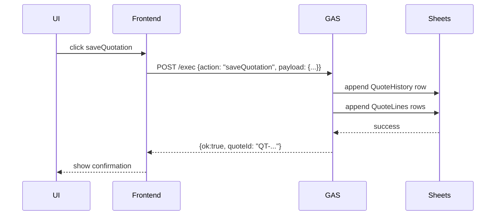

# API Reference & Flow (สรุป)

เอกสารนี้สรุป API contract ที่คาดว่าจะมีระหว่าง Frontend (PWA) กับ Google Apps Script (GAS) / Google Sheets

> หมายเหตุ: ปัจจุบัน Apps Script ยังเป็น scaffold — ห้ามแก้ไขโค้ด Apps Script โดยไม่ประสานทีม

## รูปแบบ endpoint
- Apps Script Web App (doGet/doPost) — base URL: `https://script.google.com/macros/s/<<DEPLOY_ID>>/exec`
- คำขอเป็น JSON โดยมี `action` ระบุฟังก์ชัน เช่น `getBootstrapData`, `loginUser`, `saveQuotation`

## ตัวอย่าง request/response (JSON)

### POST /exec?action=getBootstrapData
- Request body:

```json
{ "action": "getBootstrapData" }
```

- Response:

```json
{
  "ok": true,
  "data": {
    "customers": [...],
    "products": [...],
    "discountMatrixMeta": {...}
  }
}
```

## Endpoints (แนะนำ)
- `getBootstrapData` — คืนข้อมูลตั้งต้น (customers, products, discount headers)
- `loginUser` — ตรวจสอบผู้ใช้ (ถ้ามีระบบบัญชีใน Sheets)
- `registerUser`, `resetPassword` — บริหารผู้ใช้ (optional)
- `saveQuotation` — บันทึกใบเสนอราคา (QuoteHistory + QuoteLines)
- `getQuotation` — ดึงใบเสนอราคาตาม `quoteId`
- `updateProfile`, `updateSettings` — อัปเดตข้อมูลผู้ใช้

## API Flow — Mermaid Sequence



## Error Handling
- API responses should include `{ ok: false, error: { code, message } }`
- Frontend แสดงข้อความ user-friendly จาก `error.message`

---
*ถ้าต้องการ ผมสามารถสร้าง OpenAPI-like spec (YAML/JSON) ให้เป็นไฟล์เพิ่มเติมได้*