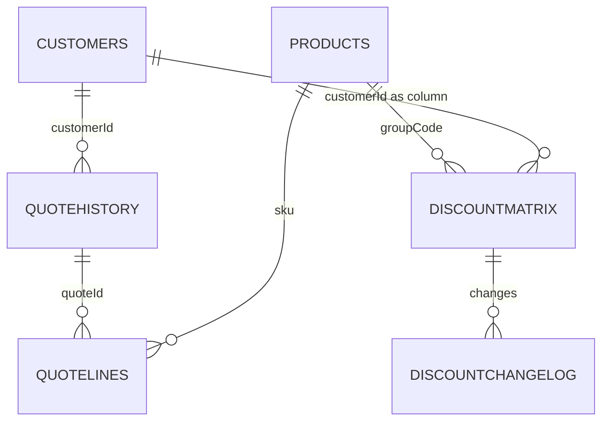
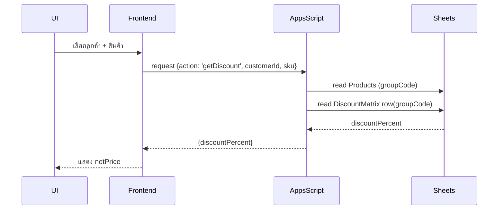

# ฐานข้อมูล (Google Sheets) — Reference สำหรับทีมพัฒนา

เอกสารนี้อธิบายโครงสร้าง Google Sheets ที่ใช้เป็นแหล่งข้อมูลหลักสำหรับระบบ "Saint-Gobain Sales System" พร้อมคำแนะนำเชิงปฏิบัติ (operational) และไดอะแกรมเพื่อให้ทีมพัฒนาสามารถทำงานต่อได้อย่างปลอดภัย

> ข้อสำคัญ: ห้ามแก้ไขโค้ด business logic (JS/Apps Script/HTML/CSS) โดยไม่ได้ประสานทีม และห้ามเปลี่ยน header row ของ `DiscountMatrix`

## ภาพรวมความสัมพันธ์ของชีต

แผนภาพ ER ย่อ:

## วิธีการค้นหาส่วนลด (Discount Lookup)

1. Frontend ส่ง `customerId` และ `sku` ไปยัง Apps Script (หรือคำนวณ local ถ้ามีข้อมูล)
2. หา `groupCode` จาก `Products` โดยใช้ `sku`
3. อ่าน `DiscountMatrix` หาแถว `groupCode` และคอลัมน์ที่ตรงกับ `customerId`
4. อ่านค่า `discountPercent` (ตัวอย่าง: `12.5`)
5. หากว่าง ให้ fallback ตามลำดับ: `CustomerProductDiscounts` → `DiscountMatrix` → `DiscountGroups.defaultDiscount` → `0`

สูตรการคำนวณ:

$$\text{netPrice} = \text{listPrice} \times \left(1 - \frac{discountPercent}{100}\right)$$

## Sequence: การคำนวณส่วนลด (ตัวอย่าง)

## ชีตหลัก (สรุปและ Data Dictionary)

### Customers
- `customerId` (string) — รหัสลูกค้า (unique)
- `customerName`, `province`, `phone`, `address`, `group`

### Products
- `sku` (string)
- `productName`, `brand`, `unit`
- `listPrice` (number)
- `groupCode` (string) — ใช้อ้างอิง `DiscountMatrix` แถว

### DiscountMatrix (สำคัญ)
- Header ต้องเป็น: `groupCode`, `description`, `<customerId_1>`, `<customerId_2>`, ...
- ค่าในคอลัมน์ลูกค้าเป็นตัวเลขร้อยละ เช่น `12.5`

กฎปฏิบัติสำหรับ `DiscountMatrix`:
- ห้ามเปลี่ยนชื่อหรือตำแหน่งของ header row
- การอัปเดตส่วนลด: copy → paste ตารางใหม่ลงใน `DiscountMatrix` เท่านั้น (ห้ามแก้ header)
- ควรสำรองข้อมูลก่อนอัปเดต (snapshot)

### CustomerProductDiscounts
- ตารางสำหรับ override ส่วนลดเฉพาะ (customerId, sku, discountPercent, effectiveFrom, effectiveTo)

### QuoteHistory / QuoteLines
- `QuoteHistory` เก็บ header ของใบเสนอราคา
- `QuoteLines` เก็บรายการในแต่ละใบ (เชื่อมโดย `quoteId`)

### DiscountChangeLog (แนะนำ)
- เก็บ record ของการเปลี่ยนแปลงใน `DiscountMatrix` เพื่อ audit trail

## Operational Recommendations

- ก่อนอัปเดต `DiscountMatrix` ให้สร้าง snapshot และบันทึก `DiscountChangeLog`
- Apps Script ควรตรวจสอบ header และรูปแบบข้อมูลก่อนอ่าน
- สร้าง validation rule: `%` ต้องไม่เป็นลบ และไม่เกิน 100

---

ถ้าต้องการ ผมสามารถเตรียมตัวอย่าง Apps Script function `getDiscount(customerId, sku)` และตัวอย่างการสำรอง `DiscountMatrix` ให้เป็นไฟล์ตัวอย่างแยก (โดยไม่แก้โค้ดที่มีอยู่) หากต้องการให้สร้าง โปรดแจ้งครับ
