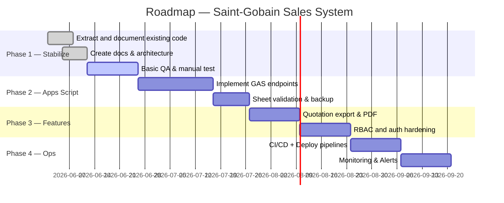

# แผนงานโครงการ (Project Plan)

เอกสารนี้สรุป roadmap, milestone, ภารกิจสำคัญ และแผนการทำงานระยะสั้น-กลาง-ยาว สำหรับทีมพัฒนา

## ภาพรวม Roadmap (6 เดือนแรก)

## Milestones
- M1 (v0.1.0): เอกสารครบ, โครงสร้างโปรเจกต์ใหม่, PWA สเถียร
- M2 (v0.2.0): GAS endpoints สำหรับ read/write Quotes และ DiscountMatrix
- M3 (v1.0.0): การยืนยันระบบ production, CI, และกระบวนการ deploy อัตโนมัติ

## กฎโหมดการพัฒนา (Development / UAT / Production)

### 1. Development Mode
- ใช้เฉพาะช่วงพัฒนาและทดสอบระบบ
- อนุญาตให้ใช้ Demo Login สำหรับพี่เกศ
- เปิด Debug Log และ Debug Menu เพื่อช่วยตรวจสอบปัญหา
- ใช้ Test Data สำหรับการทดลองและทดสอบฟีเจอร์
- ใช้สำหรับการตรวจสอบระบบเท่านั้น ไม่ใช่สำหรับลูกค้าจริง

### 2. UAT Mode
- ใช้ Login จริง
- ใช้ Google Sheet จริง
- ใช้สำหรับทดสอบก่อนขึ้น Production
- ยังไม่ใช้กับลูกค้าจริง
- ควรมีการทดสอบ end-to-end แบบใกล้เคียง Production

### 3. Production Mode
- ห้ามมี Demo Login
- ห้ามมี Debug Menu / Debug Log ที่เปิดเผยต่อผู้ใช้ทั่วไป
- ห้ามใช้ Test Data
- ต้องใช้ Login จริงเท่านั้น
- Developer Settings ทั้งหมดต้องถูกซ่อนหรือปิดใช้งาน

### 4. Demo Login Rule
- Demo Login ใช้เฉพาะพี่เกศสำหรับทดสอบระบบระหว่างพัฒนา
- ก่อนขึ้น Production ต้องลบหรือปิด Demo Login ทั้งหมด
- ต้องมีตัวแปรควบคุมสภาพแวดล้อม เช่น `APP_ENV = "development"` หรือ `APP_ENV = "production"`
- การเปลี่ยนค่า `APP_ENV` ต้องถูกกำหนดชัดเจนในเอกสารและกระบวนการ deploy

## กฎ DiscountMatrix
- DiscountMatrix เป็นข้อมูลหลักของส่วนลด
- ห้ามเปลี่ยนหัวตาราง (header row)
- ห้ามเปลี่ยนชื่อ `groupCode`
- ห้ามเปลี่ยน column รหัสลูกค้า (`customerId`)
- `Products.groupCode` ต้องเชื่อมกับ `DiscountMatrix.groupCode`
- `Customers.customerId` ต้องเชื่อมกับ column `customerId` ใน `DiscountMatrix`
- การแก้ไขส่วนลดต้องผ่านกระบวนการตรวจสอบและบันทึกก่อนนำไปใช้

## Specification Before Coding
- ทุกฟีเจอร์ใหม่ต้องมี Specification ก่อนเขียนโค้ด
- ห้ามให้ Codex เดาโครงสร้างฐานข้อมูลเอง
- ห้ามให้ Codex เปลี่ยน Google Sheet schema โดยไม่ได้รับอนุมัติจากทีม
- หากต้องเพิ่มฟิลด์หรือเปลี่ยนโครงสร้างข้อมูล จะต้องมีเอกสารสเปกและการอนุมัติก่อน

## ความเสี่ยงหลัก
- การแก้ไข `DiscountMatrix` โดยไม่ได้สำรองข้อมูล
- สิทธิการเข้าถึง Google Sheets (ต้องจำกัดเฉพาะ service account หรือ Apps Script ที่ผ่านการตรวจสอบ)

## งานประจำ (Sprint)
- Sprint length: 2 สัปดาห์
- งานแต่ละสปริน: feature / bugfix / docs / test

## Git Workflow (สรุป)
- Branches: `main` (release), `develop` (integration), `feature/*`, `hotfix/*`
- Pull Request: ต้องมี review ขั้นต่ำ 1 คน และผ่าน CI (lint + unit checks)

## Release Plan
- versioning: Semantic Versioning (MAJOR.MINOR.PATCH)
- Releases เตรียม changelog ก่อน tag

---
*หากต้องการผมสามารถสร้าง issue template, PR template และ checklist ให้ได้*