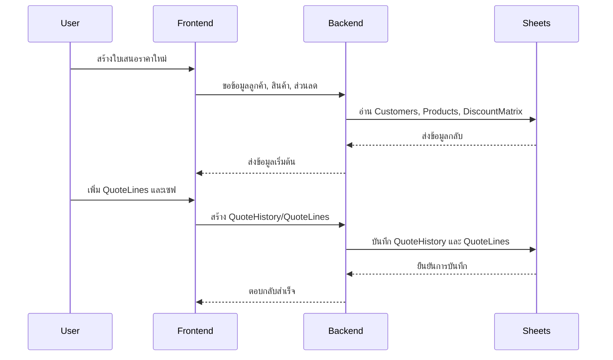

# QUOTATION_ENGINE_SPEC

## 1 Overview
ระบบ Quotation Engine เป็นระบบจัดการใบเสนอราคาที่เชื่อมต่อข้อมูลลูกค้า สินค้า ส่วนลด และประวัติการเสนอราคา เพื่อให้ทีมขายสามารถสร้าง แก้ไข บันทึกแบบร่าง ส่งออก PDF และติดตามสถานะได้อย่างเป็นระบบ

## 2 Create Quotation
- เริ่มต้นจากเลือกลูกค้าใน `Customers`
- เพิ่มรายการสินค้าโดยเลือก `Products`
- ดึงข้อมูล `Products.groupCode` เพื่อใช้คำนวณส่วนลดจาก `DiscountMatrix`
- สร้าง `QuoteLines` สำหรับแต่ละรายการ
- บันทึกข้อมูลใบเสนอราคาเบื้องต้นไว้ใน `QuoteHistory`

## 3 Edit Quotation
- ผู้ใช้สามารถแก้ไขข้อมูล `QuoteLines` เช่น จำนวน ราคา หรือส่วนลดแบบ manual
- การแก้ไขต้องไม่กระทบ `QuoteHistory` เดิม แต่ต้องเก็บเวอร์ชันการแก้ไข
- หากแก้ไขรายการ ต้องคำนวณสรุปใหม่ทันที

## 4 Save Draft
- ใบเสนอราคาที่ยังไม่ส่ง สามารถบันทึกเป็นร่างได้
- ร่างใบเสนอราคาจะถูกเก็บใน `QuoteHistory` ด้วยสถานะ `draft`
- สามารถกลับมาแก้ไขและบันทึกอีกครั้งได้

## 5 Submit
- เมื่อยืนยันใบเสนอราคา ให้เปลี่ยนสถานะเป็น `submitted`
- บันทึกวันเวลาและผู้ส่ง
- สร้างสรุปรายการ `QuoteLines` แบบ final
- อัปเดต `QuoteHistory` เพื่อเก็บเหตุการณ์การส่ง

## 6 PDF
- ระบบต้องรองรับการสร้าง PDF จากข้อมูลใน `QuoteLines` และ `Customers`
- PDF ต้องแสดงรายละเอียดรายการสินค้า, ส่วนลด, VAT, ค่าขนส่ง, ยอดสุทธิ, และหมายเหตุ
- ควรเป็นไฟล์ที่ดาวน์โหลดหรือแชร์ได้

## 7 Share Line
- ฟีเจอร์แบ่ง `QuoteLines` สามารถแชร์รายการย่อยของใบเสนอราคา
- ใช้ในกรณีที่ต้องส่งรายละเอียดบางส่วนให้ลูกค้าหรือผู้อนุมัติ
- ต้องอ้างอิง `QuoteLines` เดิมและสร้าง track ของ line ที่แชร์

## 8 History
- เก็บประวัติการแก้ไขและสถานะของใบเสนอราคาใน `QuoteHistory`
- ประวัติรวมถึงเวอร์ชันก่อนหน้า, ผู้แก้ไข, วันเวลา, และเหตุผล
- ต้องสามารถแสดง timeline ของการเปลี่ยนแปลงได้

## 9 Favorite Products
- ระบบต้องเก็บสินค้าที่ใช้บ่อยใน `CustomerFrequentProducts`
- เลือกสินค้าจาก `Products` และบันทึกเป็น favorite สำหรับลูกค้าคนนั้น
- ช่วยให้สร้างใบเสนอราคาได้เร็วขึ้น

## 10 Recent Products
- แสดงรายการสินค้าที่เพิ่งใช้ในใบเสนอราคาโดยลูกค้านั้น
- ใช้ข้อมูลจาก `QuoteLines` ย้อนหลัง
- ช่วยลดเวลาในการค้นหาสินค้าซ้ำ

## 11 Discount Flow
- ส่วนลดหลักมาจาก `DiscountMatrix`
- ใช้ `Products.groupCode` หา row และ `Customers.customerId` หา column
- หากไม่พบส่วนลด ให้ใช้ `0%` และเก็บ warning
- รองรับ `manual discount` แยกต่างหากจากการ lookup ของ `DiscountMatrix`

## 12 Promotion Flow
- Promotion สามารถกำหนดเป็นเงื่อนไขพิเศษนอกเหนือจาก DiscountMatrix
- ต้องแยกจากส่วนลดปกติและ `manual discount`
- สามารถใช้ได้เมื่อสินค้าหรือลูกค้าตรงตามเงื่อนไขที่กำหนด

## 13 Manual Discount
- Manual discount คือส่วนลดที่ผู้ใช้กำหนดเอง
- ต้องเก็บแยกจาก `discountPercent` ที่มาจาก `DiscountMatrix`
- ต้องมี audit log เมื่อมีการแก้ไข

## 14 VAT
- คำนวณภาษีมูลค่าเพิ่มจากยอดรวมก่อน VAT
- อัตราที่ใช้ 7%
- แสดงเป็นค่า VAT และยอดรวมทั้งสิ้นแยกส่วน

## 15 Shipping
- ค่าขนส่งต้องเป็นค่าแยกต่างหากจากราคาสินค้าและส่วนลด
- สามารถกำหนดเป็นค่าคงที่หรือแบบปรับตามพื้นที่
- คำนวณในสรุปใบเสนอราคาเป็น `shipping`

## 16 Remark
- รองรับการใส่หมายเหตุเพิ่มเติมในใบเสนอราคา
- ข้อความ remark ต้องถูกเก็บใน `QuoteHistory` และ PDF
- ช่วยให้มีบริบทเพิ่มเติมเวลาติดตาม

## 17 Approval Status
- ใบเสนอราคาสามารถมีสถานะอนุมัติ เช่น `pending`, `approved`, `rejected`
- สถานะต้องอัปเดตใน `QuoteHistory`
- ต้องเก็บข้อมูลผู้อนุมัติและวันที่อนุมัติ

## 18 Quote Number Running
- ระบบต้องสร้างหมายเลขใบเสนอราคาแบบต่อเนื่อง
- หมายเลขควรไม่ซ้ำและสะท้อนลำดับการสร้าง
- สามารถใช้รูปแบบ `Q-YYYYMMDD-XXXX` หรือคล้ายกัน

## 19 Google Sheet Relationship
- `Customers`: เก็บข้อมูลลูกค้าและ customerId
- `Products`: เก็บข้อมูลสินค้าและ groupCode
- `DiscountMatrix`: ให้ส่วนลดตามลูกค้าและกลุ่มสินค้า
- `QuoteHistory`: เก็บใบเสนอราคาทุกสถานะและเหตุการณ์
- `QuoteLines`: เก็บรายละเอียดรายการสินค้าในใบเสนอราคา
- `CustomerFrequentProducts`: เก็บสินค้าบ่อยของลูกค้า

## 20 API Flow
- Frontend ส่งคำร้องขอสร้าง/แก้ไขใบเสนอราคาไปยัง backend
- Backend อ่าน `Customers`, `Products`, `DiscountMatrix`
- สร้างหรืออัปเดต `QuoteHistory` และ `QuoteLines`
- ส่งผลลัพธ์กลับเป็น JSON พร้อมสถานะและข้อความ

## 21 Sequence Diagram

## 22 Error Handling
- ตรวจสอบข้อมูลลูกค้าและสินค้าให้ครบก่อนบันทึก
- หาก `DiscountMatrix` ไม่พบค่า ให้ใช้ 0% และแจ้ง warning
- หาก `QuoteLines` ว่าง ให้คืน error
- หากเซฟ `QuoteHistory` หรือ `QuoteLines` ล้มเหลว ให้คืนข้อความ error ชัดเจน

## 23 Future Features
- เพิ่มระบบ promotion engine ที่รองรับเงื่อนไขหลายรูปแบบ
- เพิ่มการเชื่อมต่อ stock real-time
- เพิ่มการอนุมัติแบบ multi-level
- เพิ่มรายงานยอดขายจากใบเสนอราคา
- เพิ่ม integration กับ e-signature และ CRM
